# CI/CD Workflow Architecture Diagram

**Generated:** October 13, 2025  
**Purpose:** Visual reference for GitHub Actions workflow orchestration

---

## Trigger Topology

```mermaid
graph TB
    subgraph "Code Events"
        PUSH[Push to main]
        PR[Pull Request]
        TAG[Tag v*]
    end
    
    subgraph "Scheduled Events"
        MON_3[Monday 3:30 AM<br/>ZAP Scan]
        MON_5[Monday 5:00 AM<br/>CodeQL]
        MON_6A[Monday 6:00 AM<br/>Secret Scan]
        MON_6B[Monday 6:00 AM<br/>Scorecard]
        MON_6C[Monday 6:00 AM<br/>Lighthouse]
    end
    
    subgraph "Manual Events"
        MANUAL_DEPLOY[workflow_dispatch<br/>Deploy]
        MANUAL_LIGHTHOUSE[workflow_dispatch<br/>Lighthouse Target]
        MANUAL_ZAP[workflow_dispatch<br/>ZAP]
    end
    
    PUSH --> CI
    PR --> CI
    PUSH --> RAG_EVAL
    PR --> RAG_EVAL
    TAG --> DEPLOY_SIGN
    
    MON_3 --> ZAP
    MON_5 --> CODEQL
    MON_6A --> SECRET
    MON_6B --> SCORECARD
    MON_6C --> LIGHTHOUSE
    
    MANUAL_DEPLOY --> DEPLOY_SIGN
    MANUAL_LIGHTHOUSE --> LIGHTHOUSE
    MANUAL_ZAP --> ZAP
    
    classDef codeEvent fill:#e1f5e1,stroke:#4caf50
    classDef schedEvent fill:#fff3e0,stroke:#ff9800
    classDef manualEvent fill:#e3f2fd,stroke:#2196f3
    
    class PUSH,PR,TAG codeEvent
    class MON_3,MON_5,MON_6A,MON_6B,MON_6C schedEvent
    class MANUAL_DEPLOY,MANUAL_LIGHTHOUSE,MANUAL_ZAP manualEvent
```



---

## Main CI Pipeline (`ci.yml`)

```
┌─────────────────────────────────────────────────────────────────┐
│                         TRIGGER: Push/PR                        │
└─────────────────────────────────────────────────────────────────┘
                                  │
                     ┌────────────┴────────────┐
                     │                         │
                     ▼                         ▼
    ┌────────────────────────────┐   ┌────────────────────────┐
    │  test (main job)           │   │  secrets-scan          │
    │  ┌──────────────────────┐  │   │  (independent)         │
    │  │ Setup Python + Node  │  │   │                        │
    │  │ Ruff                 │  │   │  TruffleHog            │
    │  │ mypy                 │  │   │  --only-verified       │
    │  │ ESLint               │  │   │  --fail                │
    │  │ Jest + Vitest        │  │   └────────────────────────┘
    │  │ Playwright E2E       │  │
    │  │ pytest (80% cov)     │  │
    │  │ Contract tests       │  │
    │  │ SBOM generation      │  │
    │  └──────────────────────┘  │
    └────────────────────────────┘
                     │
      ┌──────────────┼──────────────┐
      │              │              │
      ▼              ▼              ▼
┌──────────┐  ┌───────────┐  ┌──────────────┐
│ web_a11y │  │ web_visual│  │ web_lighthouse│
│ (axe)    │  │ (Percy)   │  │ (smoke tests) │
└──────────┘  └───────────┘  └──────────────┘
    │              │              │
    └──────────────┼──────────────┘
                   ▼
           ✅ All checks pass
```

### Job Dependencies
```
secrets-scan     (no deps)
test             (no deps)
  └── web_accessibility
  └── web_visual_regression
  └── web_lighthouse
```

### Estimated Runtime
```
Setup:           ~3 min
Linting:         ~2 min
Unit Tests:      ~3 min
E2E Tests:       ~5 min
Coverage:        ~2 min
SBOM:            ~2 min
─────────────────────────
Total (serial):  ~17 min

Parallel jobs:   +5-10 min
─────────────────────────
Full pipeline:   ~22-27 min
```

---

## Security Scanning Matrix

```
┌─────────────────────────────────────────────────────────────────┐
│                    Security Scanning Layers                     │
└─────────────────────────────────────────────────────────────────┘

Layer 1: Secret Detection
├── TruffleHog (2 workflows)
│   ├── ci.yml (inline, every run)
│   └── secret-scanning.yml (dedicated, scheduled)
│
Layer 2: Static Analysis (SAST)
├── CodeQL
│   ├── Languages: Python, JavaScript
│   ├── Schedule: Weekly Mon 5 AM
│   └── Output: SARIF → Security tab
│
Layer 3: Dynamic Analysis (DAST)
├── OWASP ZAP
│   ├── Target: Staging API
│   ├── Trigger: pull_request_target (safe mode)
│   ├── Severity Gate: High (custom script)
│   └── Schedule: Weekly Mon 3:30 AM
│
Layer 4: Supply Chain
├── OpenSSF Scorecard
│   ├── Metrics: 15+ security checks
│   ├── Schedule: Weekly Mon 6 AM
│   └── Output: SARIF + public results
│
Layer 5: Dependencies
├── npm audit (in Lighthouse workflow)
├── SBOM generation (CycloneDX)
└── Dependabot (TODO)
│
Layer 6: Container Security
├── Image Signing (Sigstore/Cosign)
├── Build Attestation
├── Provenance Tracking
└── Vulnerability Scan (TODO: Trivy)
```

---

## Container Release Flow (`deployment-sign.yml`)

```
┌─────────────────────────────────────────────────────────────────┐
│                     TRIGGER: Tag v* or Manual                   │
└─────────────────────────────────────────────────────────────────┘
                                │
                                ▼
                    ┌───────────────────────┐
                    │ Prepare Metadata      │
                    │ - Image ref           │
                    │ - Version tag         │
                    └───────────────────────┘
                                │
                                ▼
                    ┌───────────────────────┐
                    │ Build Container       │
                    │ (Docker Buildx)       │
                    │                       │
                    │ Tags:                 │
                    │ - :sha                │
                    │ - :version            │
                    └───────────────────────┘
                                │
                                ▼
                    ┌───────────────────────┐
                    │ Generate SBOM         │
                    │ (Anchore)             │
                    │ Format: CycloneDX     │
                    └───────────────────────┘
                                │
                                ▼
                    ┌───────────────────────┐
                    │ TODO: Scan Image      │
                    │ (Trivy)               │
                    │ Severity: HIGH/CRIT   │
                    └───────────────────────┘
                                │
                                ▼
                    ┌───────────────────────┐
                    │ Sign Image            │
                    │ (Cosign keyless)      │
                    │                       │
                    │ OIDC Provider:        │
                    │ GitHub Actions        │
                    └───────────────────────┘
                                │
                                ▼
                    ┌───────────────────────┐
                    │ Create Attestation    │
                    │ - Build metadata      │
                    │ - Git provenance      │
                    │ - SBOM checksum       │
                    └───────────────────────┘
                                │
                                ▼
                    ┌───────────────────────┐
                    │ Verify Signature      │
                    │ (Self-check)          │
                    │                       │
                    │ Expected Identity:    │
                    │ workflow@ref          │
                    └───────────────────────┘
                                │
                                ▼
                    ┌───────────────────────┐
                    │ Upload Artifacts      │
                    │ - SBOM                │
                    │ - Signature           │
                    │ - Attestation         │
                    │ - Metadata            │
                    └───────────────────────┘
                                │
                                ▼
                    ┌───────────────────────┐
                    │ Publish to Release    │
                    │ (if tag trigger)      │
                    └───────────────────────┘
                                │
                                ▼
                        ✅ Signed Image
                        Ready for Deployment
```

---

## Performance Monitoring

### Lighthouse CI Flow

```
┌─────────────────────────────────────────────────────────────────┐
│     TRIGGER: Push/PR (web/**) or Schedule or Manual Dispatch    │
└─────────────────────────────────────────────────────────────────┘
                                │
                    ┌───────────┴───────────┐
                    │                       │
                    ▼                       ▼
            ┌──────────────┐        ┌──────────────┐
            │  localhost   │        │   staging    │
            │  (default)   │        │  (manual)    │
            └──────────────┘        └──────────────┘
                    │                       │
                    ▼                       ▼
        ┌──────────────────┐    ┌──────────────────┐
        │ Build + Start    │    │ Check Reachable  │
        │ Next.js Server   │    │ (skip if down)   │
        └──────────────────┘    └──────────────────┘
                    │                       │
                    └───────────┬───────────┘
                                ▼
                    ┌───────────────────────┐
                    │ Run Lighthouse CI     │
                    │ - Performance         │
                    │ - Accessibility       │
                    │ - Best Practices      │
                    │ - SEO                 │
                    │ - PWA                 │
                    └───────────────────────┘
                                │
                                ▼
                    ┌───────────────────────┐
                    │ Compare to Baseline   │
                    │ (custom script)       │
                    │                       │
                    │ Δ Performance: -3     │
                    │ Δ A11y: +2            │
                    └───────────────────────┘
                                │
                                ▼
                    ┌───────────────────────┐
                    │ TODO: Budget Gates    │
                    │ Fail if regression    │
                    │ > threshold           │
                    └───────────────────────┘
                                │
                                ▼
                    ┌───────────────────────┐
                    │ Upload Artifacts      │
                    │ - Reports             │
                    │ - Server logs         │
                    └───────────────────────┘
```

### RAG Evaluation Flow

```
┌─────────────────────────────────────────────────────────────────┐
│          TRIGGER: Push/PR affecting theo/** or data/eval        │
└─────────────────────────────────────────────────────────────────┘
                                │
                                ▼
                    ┌───────────────────────┐
                    │ Detect Changed        │
                    │ RAG Modules           │
                    │ (detect_rag_modules)  │
                    └───────────────────────┘
                                │
                                ▼
                    ┌───────────────────────┐
                    │ Run RAG Eval          │
                    │ (only affected)       │
                    │                       │
                    │ Metrics:              │
                    │ - Answer relevancy    │
                    │ - Faithfulness        │
                    │ - Context precision   │
                    └───────────────────────┘
                                │
                                ▼
                    ┌───────────────────────┐
                    │ TODO: Compare         │
                    │ to Baseline           │
                    │ (regression check)    │
                    └───────────────────────┘
                                │
                                ▼
                    ┌───────────────────────┐
                    │ Upload Metrics        │
                    │ perf_metrics/         │
                    └───────────────────────┘
```

---

## Concurrency Control

### Current Strategy

```yaml
# Lighthouse workflow only
concurrency:
  group: ${{ (target == 'staging') && 'lhci-staging' || format('lhci-{0}', github.ref) }}
  cancel-in-progress: true
```

**Effect:**
- ✅ Prevents staging test collisions (single queue)
- ✅ Allows parallel localhost runs per branch
- ⚠️ Other workflows have no concurrency control

### Recommended Addition

```yaml
# Add to ci.yml
concurrency:
  group: ci-${{ github.ref }}
  cancel-in-progress: true  # Cancel stale PR builds

# Add to deployment-sign.yml
concurrency:
  group: release-${{ github.ref }}
  cancel-in-progress: false  # Never cancel releases
```

---

## Artifact Flow

```
                    ┌─────────────────────┐
                    │   Workflow Run      │
                    └─────────────────────┘
                              │
              ┌───────────────┼───────────────┐
              ▼               ▼               ▼
      ┌──────────────┐ ┌──────────────┐ ┌──────────────┐
      │   Coverage   │ │    SBOM      │ │   Security   │
      │   Reports    │ │   (CycloneDX)│ │   Reports    │
      │              │ │              │ │              │
      │ - coverage.xml│ │ - Python    │ │ - ZAP JSON   │
      │ - Vitest cov │ │ - Node.js    │ │ - TruffleHog │
      └──────────────┘ └──────────────┘ │ - CodeQL SARIF│
                                        └──────────────┘
              │               │               │
              └───────────────┼───────────────┘
                              ▼
                    ┌─────────────────────┐
                    │ Upload as Artifacts │
                    │ Retention: 90 days  │
                    │ (default)           │
                    └─────────────────────┘
                              │
              ┌───────────────┼───────────────┐
              ▼               ▼               ▼
      ┌──────────────┐ ┌──────────────┐ ┌──────────────┐
      │   GitHub     │ │  Security    │ │   Release    │
      │   Actions    │ │  Dashboard   │ │   Assets     │
      │   Tab        │ │  (SARIF)     │ │  (on tag)    │
      └──────────────┘ └────────────── ┘ └──────────────┘
```

**Retention Policy:**
- Default: 90 days (GitHub free/pro)
- Recommended: 14 days for most artifacts (save storage)
- Exception: Release artifacts (indefinite)

---

## Permissions Matrix

| Workflow | contents | packages | id-token | attestations | security-events | actions | pull-requests |
|----------|----------|----------|----------|--------------|-----------------|---------|---------------|
| ci.yml | read | - | - | - | - | - | read |
| security-zap.yml | read | - | - | - | write | read | - |
| security-codeql.yml | read | - | - | - | write | read | - |
| security-scorecard.yml | read | - | - | - | write | read | - |
| secret-scanning.yml | read | - | - | - | - | - | - |
| deployment-sign.yml | read | write | write | write | - | - | - |
| rag-eval.yml | read (default) | - | - | - | - | - | - |
| lighthouse.yml | read | - | - | - | - | - | - |

**Security Grade: A+**
- ✅ All workflows follow least-privilege
- ✅ No unnecessary `write` permissions
- ✅ Security workflows properly scoped

---

## Recommended Future State

### Deployment Pipeline (TODO)

```
┌─────────────────────────────────────────────────────────────────┐
│              Release Containers Workflow Completes              │
└─────────────────────────────────────────────────────────────────┘
                                │
                                ▼
                    ┌───────────────────────┐
                    │ Verify Image          │
                    │ Signature (Cosign)    │
                    └───────────────────────┘
                                │
                                ▼
                    ┌───────────────────────┐
                    │ Deploy to Staging     │
                    │ (auto)                │
                    └───────────────────────┘
                                │
                                ▼
                    ┌───────────────────────┐
                    │ Run Smoke Tests       │
                    │ - Health check        │
                    │ - Auth flow           │
                    │ - Critical APIs       │
                    └───────────────────────┘
                                │
                ┌───────────────┴───────────────┐
                ▼                               ▼
        ┌──────────────┐              ┌──────────────┐
        │ Tests Pass   │              │ Tests Fail   │
        └──────────────┘              └──────────────┘
                │                               │
                ▼                               ▼
    ┌───────────────────────┐      ┌───────────────────────┐
    │ Deploy to Production  │      │ Rollback Staging      │
    │ (requires approval)   │      │ Alert Team            │
    └───────────────────────┘      └───────────────────────┘
                │
                ▼
    ┌───────────────────────┐
    │ Health Check          │
    │ Monitor Metrics       │
    │ Record Deployment     │
    └───────────────────────┘
```

---

## Optimization Opportunities

### 1. Job Parallelization
**Current:** Sequential linting/testing within single `test` job  
**Proposed:** Split into parallel jobs

```
┌──────────────┐  ┌──────────────┐  ┌──────────────┐
│ lint-python  │  │ lint-node    │  │ test-python  │
└──────────────┘  └──────────────┘  └──────────────┘
                          │
                          ▼
                  ┌──────────────┐
                  │ test-node    │
                  │ (unit + e2e) │
                  └──────────────┘
```

**Savings:** ~5 minutes (parallel linting while tests run)

### 2. Cache Strategy
```
┌─────────────────────────────────────────┐
│           Cache Hierarchy               │
├─────────────────────────────────────────┤
│ pip packages          → ~/.cache/pip    │
│ npm packages          → ~/.npm         │
│ Playwright browsers   → ~/.cache/ms-pw  │
│ Next.js build         → .next/cache     │
│ Python mypy           → .mypy_cache     │
└─────────────────────────────────────────┘
```

**Current:** ✅ pip, npm  
**Missing:** ⚠️ Playwright, Next.js, mypy

**Potential Savings:** 5-7 minutes per run

### 3. Conditional Execution
**Already Implemented:**
- ✅ Lighthouse (path filter)
- ✅ RAG eval (path filter)
- ✅ Percy (token check)
- ✅ ZAP (secret check)

**Could Add:**
- Path filters for Python-only changes (skip Node tests)
- Path filters for Node-only changes (skip Python tests)

---

## Documentation Gaps (TODO)

1. **Branch Protection Rules**
   - Which status checks are required?
   - Who can bypass?
   - Signed commits required?

2. **Secret Management**
   - How to rotate secrets
   - Expiration policy
   - Access audit

3. **Runbook**
   - Handling workflow failures
   - Emergency deployment procedure
   - Rollback process

4. **SLA/SLO**
   - Max acceptable CI time
   - Uptime targets for workflows
   - Incident response time

---

**Diagram Version:** 1.0  
**Last Updated:** 2025-10-13  
**Maintained By:** DevOps Team
